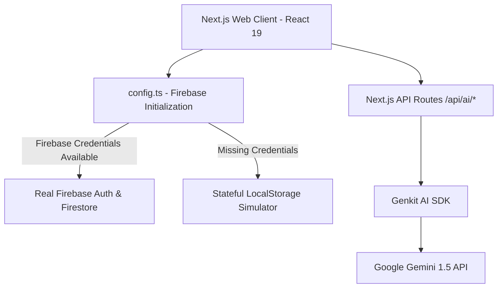
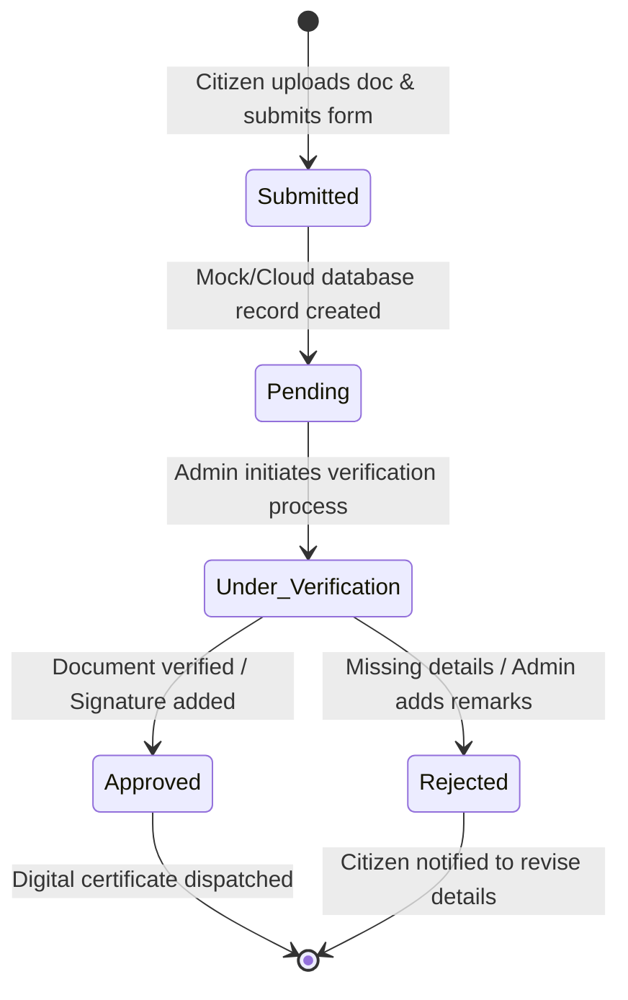
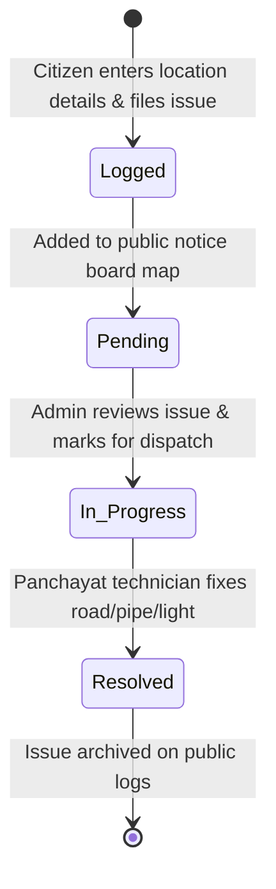

# GramVikas Portal – Digital Panchayat Hub 🌾

Empowering rural communities through transparent digital governance, simplified public service applications, and cutting-edge, AI-powered agricultural advisory tools.


---

## 📖 Table of Contents
1. [Project Overview](#-project-overview)
2. [Key Core Features](#-key-core-features)
3. [System Architecture](#%EF%B8%8F-system-architecture)
4. [Tech Stack](#%EF%B8%8F-tech-stack)
5. [Folder & Directory Layout](#-folder--directory-layout)
6. [Offline Database Simulator & Mock Accounts](#-offline-database-simulator--mock-accounts)
7. [AI Capabilities & API Endpoints](#-ai-capabilities--api-endpoints)
8. [State Flow Diagrams](#-state-flow-diagrams)
9. [Design System & Aesthetics](#-design-system--aesthetics)
10. [Setup & Installation Instructions](#-setup--installation-instructions)
11. [Environment Variables Reference](#-environment-variables-reference)
12. [Deployment and Production Configuration](#-deployment-and-production-configuration)

---

## 🎯 Project Overview
The **GramVikas Portal** is a next-generation web application designed to bridge the digital gap in rural governance. It serves three distinct user roles—**Citizens**, **Farmers**, and **Panchayat Administrators**—offering features ranging from certificate applications and grievance registration to smart crop forecasting and automated scheme advising. 

The application utilizes **Next.js 15 (App Router)** and **React 19** to ensure sub-second rendering speeds, fully responsive layouts, and zero-loading-state animations. It is powered by **Google Genkit** and the **Gemini 1.5 Flash** model for all AI interactions.

---

## ✨ Key Core Features

### 👤 Role-Specific Portals
*   **Administrator Dashboard**: Oversees village applications (birth, death, income, and residence certificates), reviews and dispatches public grievance resolutions, updates local notices, and maintains the community facility registry.
*   **Citizen Dashboard**: Allows residents to submit digital certificate applications, upload documents, track application status in real-time, view notifications, and log public complaints.
*   **Farmer Advisory Center**: Provides crop recommendations based on soil types, seasonal weather advisory, fertilizer calculator tools, and simulated market-rate predictions.

### 🛠️ Interactive Widgets & Components
*   **Grievance Box (`GrievanceBox.tsx`)**: Allows citizens to file complaints under categories like road repairs, streetlights, garbage, or water leaks, complete with mock image attachments and automatic location tags.
*   **Smart Calendar (`SmartCalendar.tsx`)**: Tracks village events, Panchayat assembly meetings (Gram Sabha), vaccination drives, and harvest festivals.
*   **Village Directory & Facilities Map (`VillageDirectory.tsx`)**: Displays an interactive directory of local resources (schools, veterinary clinics, primary health centers, water storage tanks, and bank branches).
*   **Chatbot Widget (`ChatbotWidget.tsx`)**: An AI assistant embedded in the corner of the portal, ready to answer questions about local programs, agricultural queries, and portal operations.

---

## 🛠️ System Architecture

The portal has been engineered to work in both **Online Cloud Mode** (using real Google Firebase services) and **Offline Simulation Mode** (using a stateful localStorage simulator).



---

## ⚡ Tech Stack

| Layer | Technologies Used | Purpose |
| :--- | :--- | :--- |
| **Frontend Core** | Next.js 15 (App Router), React 19, TypeScript | Structural layer, SEO metadata engine, client-side routing, and DOM rendering. |
| **Styling** | Vanilla CSS, PostCSS, TailwindCSS v4 | Modern styling tokens, layout grids, animations, glassmorphism card filters, and dark-mode configurations. |
| **AI Integration** | Genkit SDK, `@genkit-ai/google-genai` | Multi-agent prompts, tool configurations, and streamlined API calls to Gemini. |
| **Database & Auth**| Firebase v12 (Firestore / Auth) | Handles production accounts, persistent storage, and live document sync. |
| **Mock Database**  | `src/firebase/simulator.ts` (LocalStorage wrapper) | Fully interactive local simulation of all database queries and authentication routines. |
| **Animations** | Framer Motion | Fluid micro-animations, slide-ins, modal entries, and visual page transitions. |
| **Icons** | Lucide React | Clean, scalable visual indicators and symbols across all dashboards. |

---

## 📂 Folder & Directory Layout

```
├── .next/                    # Automatically generated build assets
├── docs/                     # Additional project guides and technical specifications
├── public/                   # Static media assets, icons, and site graphics
└── src/
    ├── app/                  # Next.js App Router root layout & page files
    │   ├── api/              # Server-side API routes
    │   │   └── ai/           # AI services (chat, crop-advisor, market, weather)
    │   ├── auth/             # Login, sign-up, and registration pages
    │   ├── dashboard/        # Role-based dashboards
    │   │   ├── admin/        # Panchayat Admin view
    │   │   ├── citizen/      # General villager portal
    │   │   └── farmer/       # Agricultural workspace
    │   ├── globals.css       # Core layout tokens and design defaults
    │   ├── layout.tsx        # Shell wrapping all pages (includes ToastProvider)
    │   └── page.tsx          # Landing / Entry portal
    ├── components/           # Reusable UI widgets
    │   ├── ui/               # Atomic layout utilities (Modals, Toast toasts)
    │   ├── ChatbotWidget.tsx # AI Chat overlay UI
    │   ├── GrievanceBox.tsx  # Citizen complaint management
    │   ├── NoticeBoard.tsx   # General announcements system
    │   ├── Sidebar.tsx       # Main dashboard layout drawer
    │   ├── SmartCalendar.tsx # Village timeline & scheduler
    │   └── VillageDirectory.tsx # Public assets lookup
    └── firebase/             # Database configs
        ├── config.ts         # Router branching to cloud or simulator
        └── simulator.ts      # Client database mock engine
```

---

## 💾 Offline Database Simulator & Mock Accounts

To support offline-first development, local trials, and lightning-fast prototyping, the portal comes equipped with a database simulator. If you launch the app without filling in `.env` credentials, it seeds your browser's local storage with initial dataset values (notices, complaints, facilities, and active user credentials) and routes all database reads and writes to `localStorage`.

### 🔑 Demo Credentials
You can bypass cloud setup immediately by running in simulated mode and logging in with any of these pre-seeded roles:

| Role | Username / Email | Password | Seeded Data & Access |
| :--- | :--- | :--- | :--- |
| **Citizen** | `citizen@village.com` | *Any string* | Income and residence application forms, grievance log, personal status feeds. |
| **Farmer** | `farmer@farm.com` | *Any string* | Custom land size parameters (3.5 acres, loamy soil), active crop advisory feeds. |
| **Admin** | `admin@gramvikas.gov.in` | *Any string* | Full validation suite, certificate approval switches, notice board editor, facility manager. |

---

## 🤖 AI Capabilities & API Endpoints

All AI utilities are wrapped inside standard Next.js Route Handlers. Each handler checks for the presence of a `GOOGLE_GENAI_API_KEY` or `GEMINI_API_KEY` and configures the `gemini-1.5-flash` model.

### 📋 List of AI Services
1.  **AI Chatbot (`/api/ai/chat`)**
    *   *Prompt Scope*: Interacts with general queries, explains site components, and provides contact info for village services.
2.  **Crop Advisor (`/api/ai/crop-advisor`)**
    *   *Prompt Scope*: Recommends seed varieties, fertilizer ratios, and disease prevention based on soil type, acreage, and season.
3.  **Scheme Recommender (`/api/ai/scheme-advisor`)**
    *   *Prompt Scope*: Evaluates farmer metrics (income, land size) and matches them to suitable public subsidies or development schemes.
4.  **Weather Advisor (`/api/ai/weather-advisor`)**
    *   *Prompt Scope*: Analyzes upcoming temperature, wind, and precipitation to suggest critical agricultural practices.
5.  **Market Analyst (`/api/ai/market-advisor`)**
    *   *Prompt Scope*: Predicts crop pricing trends and estimates regional market demand.
6.  **Panchayat Document OCR (`/api/ai/ocr`)**
    *   *Prompt Scope*: Processes uploaded document images, automatically extracting details for certificate approvals.

---

## 📊 State Flow Diagrams

### 📝 Certificate Application Lifecycle
The journey of a document request (Birth, Death, Income, or Residence certificate) filed by a citizen:



### 🚨 Grievance Resolution Workflow
The lifecycle of a public repair or facility complaint:



---

## 🎨 Design System & Aesthetics

The UI design is crafted to feel modern, clean, and highly professional:
*   **Colors**: A carefully curated warm color scheme featuring rich forest greens (`#16a34a`), warm stone hues (`#fafaf9`), and deep slate accents, designed to feel clean and agricultural yet high-tech.
*   **Glassmorphism**: Dashboard cards use fine border highlights (`rgba(255, 255, 255, 0.4)`), deep background blurs (`backdrop-filter: blur(16px)`), and drop shadows to stay readable on all backgrounds.
*   **Dark Mode**: Native, system-aware dark theme that changes HSL background tones dynamically, ensuring accessibility for night-time operations.
*   **Typography**: Clean sans-serif typography utilizing Google Fonts' *Inter* to maximize legibility on low-resolution mobile devices.
*   **Transitions**: Buttons, modals, and sidebar links feature subtle micro-interactions (e.g. springy hovers, fade-ins) to feel highly responsive.

---

## 🚀 Setup & Installation Instructions

Ensure you have **Node.js (v18 or above)** and **npm** installed on your local machine.

### 1. Extract and Install Dependencies
Navigate into the root of the workspace directory and install all core dependencies:
```bash
# Navigate to repository path
cd d:\vill_mang_sys

# Install dependencies (Next 15, React 19, Tailwind, Lucide, Framer Motion)
npm install
```

### 2. Configure Environment Secrets
Create a `.env` file in your root workspace:
```bash
# Windows Command Prompt / Powershell
copy .env.example .env
```

### 3. Run the Development Server
Next.js 15 uses Turbopack by default for lightning-fast compilation times during development:
```bash
# Start Turbopack compiler
npm run dev
```

The application will be compiled and launched at:
👉 **[http://localhost:3000](http://localhost:3000)**

---

## 📋 Environment Variables Reference

Provide these parameters in your `.env` to enable real database integrations and actual AI interactions.

```ini
# Firebase Cloud Configs (Optional - Simulator is used if left blank)
NEXT_PUBLIC_FIREBASE_API_KEY="your_api_key_here"
NEXT_PUBLIC_FIREBASE_AUTH_DOMAIN="your_project_id.firebaseapp.com"
NEXT_PUBLIC_FIREBASE_PROJECT_ID="your_project_id"
NEXT_PUBLIC_FIREBASE_STORAGE_BUCKET="your_project_id.appspot.com"
NEXT_PUBLIC_FIREBASE_MESSAGING_SENDER_ID="your_sender_id"
NEXT_PUBLIC_FIREBASE_APP_ID="your_app_id"

# Google GenAI / Gemini Configs (Required for AI features to work)
GOOGLE_GENAI_API_KEY="AIzaSyYourGeminiApiKeyHere"
```

---

## 📦 Deployment and Production Configuration

To build the portal for production use, compile the application into static bundles and optimized server-side chunks:

```bash
# Compile and build the NextJS application
npm run build

# Start the compiled production application server
npm run start
```

For deployment to cloud platforms like **Vercel** or **Netlify**, configure the build script to `next build` and inject the environment variables listed above into the platform's settings dashboard.

---

*Built with care to support rural digital empowerment and smart agricultural governance.*
